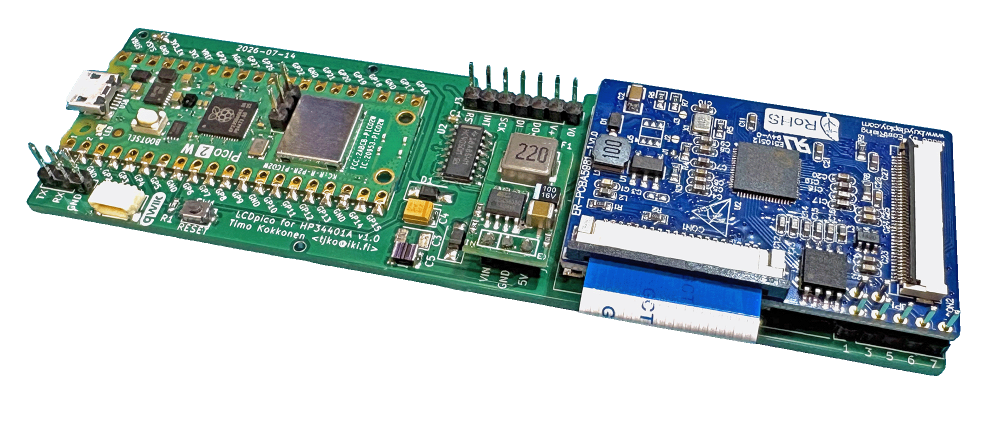
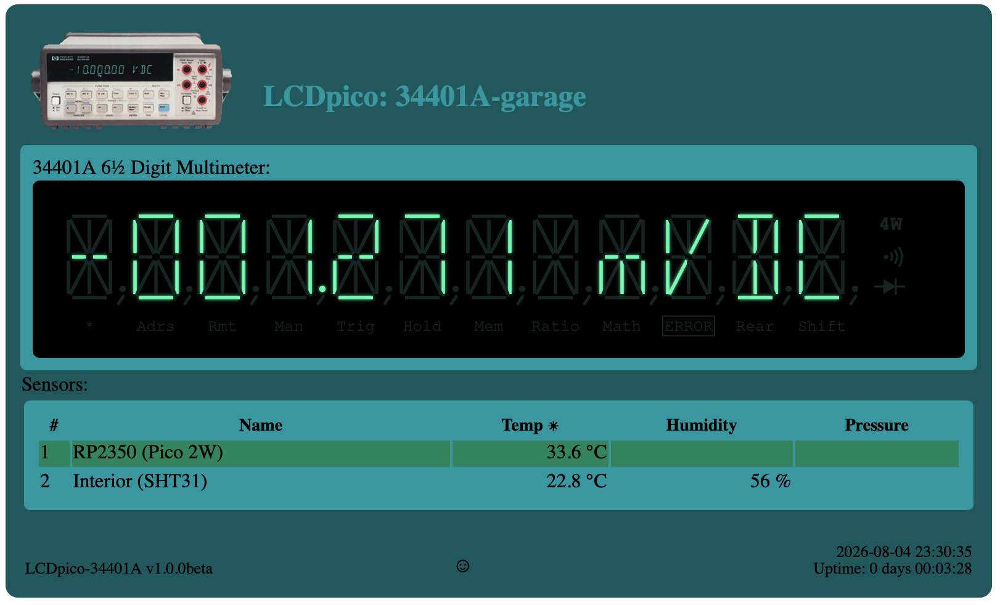

# LCDpico-34401a
TFT LCD Driver for HP34401 using RPi Pico 2 (W)

This project is a LCD (TFT) replacement for the original vacuum fluorescent tube (VFD) display on HP/Agilent/Keysight 34401A multimeters.

This project is based on following projects:

- https://github.com/openscopeproject/HP34401a-OLED-FW
- https://github.com/Ian-Johnston/34401A_VS_Display

This project is slightly different as it uses Raspberry Pi Pico 2W module, this allows network access over WiFi connection. Firmware has support for SSH/Telnet server that provide access to SCPI style command interface. And there is also HTTP server to provide simple GUI to read display remotely.
Additionally LCD display is drawn in graphics mode (16bit colors) allowing use of per-rendered graphics for the display. Initial "theme" makes HP 34401A display look like it has nixie tubes in it.

### Features
- 2D Accelerated graphics (using LT768x graphics controller)
  - 16bps graphics (with support for custom themes)
  - Double buffered display (no flicker)
- SCPI "like" programming interface (see [Command Reference](commands.md))
- TTL (3.3V) serial console for configuration
- Support for I2C sensors via QWIIC (QT) connector (support up to 8 sensors)
- WiFi support (if using Pico 2 W)
  - HTTP server with TLS (SSL) support
  - SSH server for console access
  - Telnet server for console access

### Web Interface

When using Pico 2W, it is possible to enable HTTP server that provides simple interface to remotely view meter display.

### Parts List

- PCB:[LCDpico for 34401A](boards/34401a/)
- MCU Module: Raspberry Pi Pico 2 W (or plain "Pico 2" if WiFi functionality is not desired).
- Display Controller (GPU): [ER-PCBA5981-1](https://www.buydisplay.com/download/manual/ER-PCBA5981-1_Datasheet.pdf) (LTLT7680 graphics controller board with FFC & ZIF connectors)
- TFT Panel: [ER-TFT3.71-1](https://www.buydisplay.com/download/manual/ER-TFT3.71-1_Datasheet.pdf)  (3.71" TFT with ST7701S controller)
- Panel mount USB cable that fits in (unused) pre-drilled holes for BNC connectors at 34401A back panel (for updating firmware easily)
- 5V buck converter module (TO-220 form factor)

#### Sources for parts:
- TFT Panel and LT7680 controller: https://www.buydisplay.com/bar-type-3-71-inch-240x960-ips-tft-lcd-display-spi-rgb-interface
- USB panel mount cable: https://www.adafruit.com/product/6069 (requires additional USB-C to Micro-USB adapter)

### Connection to 34401A

This display module is meant to be connected to the front panel, where the cable is soldered on the display module PCB.
Connector on main PCB (34401-61602) is W601.

See Ian Johnston's video on how to install his TFT conversion: https://www.youtube.com/watch?v=MFfk2P_R7ck

W601 (34401A)|J1 (lcd-pico-34401a)|Notes
----|---------------|-----
 1|1|AGND
 2|3|FPDO
 3|2|+18V
 4|5|IGFPSCK
 5| |FIL1 (not used)
 6|4|IGFPDI
 7| |-18V (not used)
 8|7|IGFPRES (optional)
 9| |AGND
10|6|IGFPINT (optional)
11| |FIL2 (not used)
12| |2.5V (not used)

