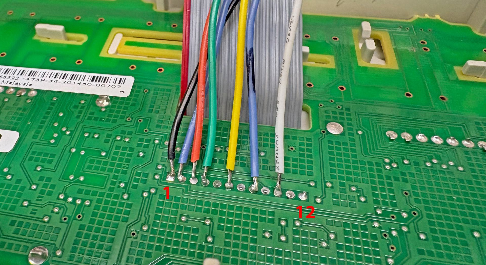

# LCDpico-34401a
TFT LCD Driver for HP34401 using RPi Pico 2 (W)

This project is a LCD (TFT) replacement for the original vacuum fluorescent tube (VFD) display on HP/Agilent/Keysight 34401A multimeters.


This project is based on following projects:

- https://github.com/openscopeproject/HP34401a-OLED-FW
- https://github.com/Ian-Johnston/34401A_VS_Display

This project takes slightly different approach as it uses Raspberry Pi Pico 2W module. This allows network access over WiFi connection. Firmware has support for SSH/Telnet server that provide access to SCPI style command interface. And there is also HTTP server to provide simple GUI to read display remotely.
Additionally LCD display is drawn in graphics mode (16bit colors) allowing use of per-rendered graphics for the display.
Initial "theme" makes HP 34401A display look like it has Nixie tubes as display.

Since RP2350 has two cores, one core is used to solely monitor the serial communications between front panel and the meter and update the LCD display. While the other is free to handle I/O and all the other tasks.


### Features
- 2D accelerated graphics (using LT768x graphics controller)
  - 16bpp graphics (with support for custom themes)
  - Double buffered display (no flickering)
- SCPI "like" programming interface (see [Command Reference](commands.md))
- USB and TTL (3.3V) serial console for configuration (NOTE! these should only be used for configuration and be disconnected when using meter for measurements)
- Support for I2C temperature sensors via QWIIC / STEMMA QT connector (support for up to 8 sensors): [Supported Sensors](https://github.com/tjko/pico-sensor-lib/blob/main/README.md)
- WiFi support (if using Pico 2 W)
  - HTTP server with TLS (SSL) support
  - SSH server for console access
  - Telnet server for console access


### Web Interface

When using Pico 2W, it is possible to enable HTTP server that provides simple interface to remotely view meter display.


### Parts List

- PCB: [LCDpico for 34401A](boards/34401a/)
- MCU Module: [Raspberry Pi Pico 2 W](https://www.raspberrypi.com/products/raspberry-pi-pico-2/) (or plain "Pico 2" if WiFi functionality is not desired).
- Display Controller (GPU): [ER-PCBA5981-1](https://www.buydisplay.com/download/manual/ER-PCBA5981-1_Datasheet.pdf) (LTLT7680 graphics controller board with FFC & ZIF connectors)
- TFT Panel: [ER-TFT3.71-1](https://www.buydisplay.com/download/manual/ER-TFT3.71-1_Datasheet.pdf)  (3.71" TFT with ST7701S controller)
- Panel mount USB cable that fits in (unused) pre-drilled holes for BNC connectors at 34401A back panel (for updating firmware easily)
- 5V buck converter module (TO-220 form factor)
- 1.0mm 20pin FFC ("flat-flex") cable about 50-80mm long

#### Sources for parts:
- TFT Panel and LT7680 controller: https://www.buydisplay.com/bar-type-3-71-inch-240x960-ips-tft-lcd-display-spi-rgb-interface
- USB panel mount cable: https://www.adafruit.com/product/6069 (requires additional USB-C to Micro-USB adapter)
- 1.0mm 20pin FFC cable (50mm): https://www.digikey.com/en/products/detail/gct/10-20-A-0050-C-4-08-4-T/22247591

### Connection to 34401A

This display module is meant to be connected to the front panel, where the cable is soldered on the display module PCB.
Connector on main PCB (34401-61602) is W601.

See Ian Johnston's video on how to install his TFT conversion: https://www.youtube.com/watch?v=MFfk2P_R7ck


W601 (34401A)|J1 (lcdpico-34401a)|Notes
----|---------------|-----
 1|1|AGND
 2|3|FPDO
 3|2|+18V
 4|5|IGFPSCK
 5| |FIL1 (not used)
 6|4|IGFPDI
 7| |-18V (not used)
 8|7|IGFPRES (optional)
 9| |AGND
10|6|IGFPINT (optional)
11| |FIL2 (not used)
12| |2.5V (not used)




## Firmware
Firmware is developed in C using the Pico-SDK. Pre-compiled firmware is released when there is new major features or bug fixes.

Latest pre-compiled firmware image can be found here: [Releases](https://github.com/tjko/lcdpico-34401a/releases)

To get latest firmware with latest updates/fixes you must compile the firmware from the sources.


### Installing firmware image
Firmware can be installed via the built-in UF2 bootloader on the Raspberry Pi Pico or using the debug header with Picoprobe, etc...

#### Selecting Right Firmware to use
Each release (zip file) contains multiple different firmware files.
Make sure to select firmware for the board you're using and for the pico model ("pico_w" if using Pico W).

Firmware filenames use format: lcdpico-<board_model>-<pico_model>.uf2
```
lcdpico-34401A-pico2_w.uf2
```

#### Upgrading Firmware
Firmware upgrade steps:
* Boot Pico into UF2 bootloader. This can be done in two ways:
  1)  Press and hold "bootsel" button and then press and release "reset" button.
  2)  Issue command: SYS:UPGRADE
* Copy firmware file to the USB mass storage device that appears.
* As soon as firmware copy is complete, Pico will reboot and run the lcdpico firmware.

### Building Firmware Images

Raspberry Pi Pico C/C++ SDK is required for compiling the firmware:

##### Install Pico SDK
Pico SDK must be installed working before you can compile fanpico.

Instructions on installing Pico SDK see: [Getting started with Raspberry Pi Pico](https://datasheets.raspberrypi.com/pico/getting-started-with-pico.pdf)

(Make sure PICO_SDK_PATH environment variable is set)

##### Downloading sources

Create some directory for building lcdpico ('src' used in this example):
```
$ mkdir src
$ cd src
$ git clone https://github.com/tjko/lcdpico-34401a.git
$ git submodule update --init --recursive
```

##### Building the firmware

To build lcdpico firmware, first create a build directory:
```
$ cd lcdpico-34401a
$ mkdir build
$ cd build
$ cmake ..
```

Then compile firmware:
```
$ make -j
```

After successful compile you should see firmware binary in the build directory:
sub-directory:

```
$ ls *.uf2
lcdpico.uf2
```

If you have picotool installed you can check the firmware image information:
```
$ picotool info -a lcdpico.uf2
File lcdpico.uf2 family ID 'rp2350-arm-s':

Program Information
 name:                lcdpico
 version:             1.0.0
 web site:            https://kokkonen.net/lcdpico/
 description:         LCDpico-34401A Display Controller
 features:            USB stdin / stdout
 boot settings:       bootdelay = 0
                      safemode = 0
                      sysclock = 0
 binary start:        0x10000000
 binary end:          0x101ccfa0
 embedded drive:      0x103bf000-0x103fd000 (248K): littlefs flags 0x0033 rw
 target chip:         RP2350
 image type:          ARM Secure

Fixed Pin Information
 0:                   TTL Serial: TX
 1:                   TTL Serial: RX
 2:                   I2C: SDA
 3:                   I2C: SCL
 4:                   DMM: DO
 5:                   LCD SPI: CS
 6:                   LCD SPI: SCK
 7:                   LCD SPI: TX
 9:                   LCM Reset
 10:                  LCM Backlight (PWM)
 11:                  LCM Interrupt
 12:                  LCM SPI: RX
 13:                  LCM SPI: CS
 14:                  LCM SPI: SCK
 15:                  LCM SPI: TX
 16:                  DMM: DI
 18:                  DMM: SCK
 19:                  DMM: INT
 20:                  DMM: RST
 25:                  On-board LED (output)

Build Information
 sdk version:         2.3.0
 pico_board:          pico2_w
 boot2_name:          boot2_w25q080
 build date:          Aug  3 2026
 build attributes:    Release

Metadata Block 1
 address:             0x10000138
 next block address:  0x101ccf8c
 block type:          image def
 target chip:         RP2350
 image type:          ARM Secure
 extra security:      not enabled

Metadata Block 2
 address:             0x101ccf8c
 next block address:  0x10000138
 block type:          ignored
```


