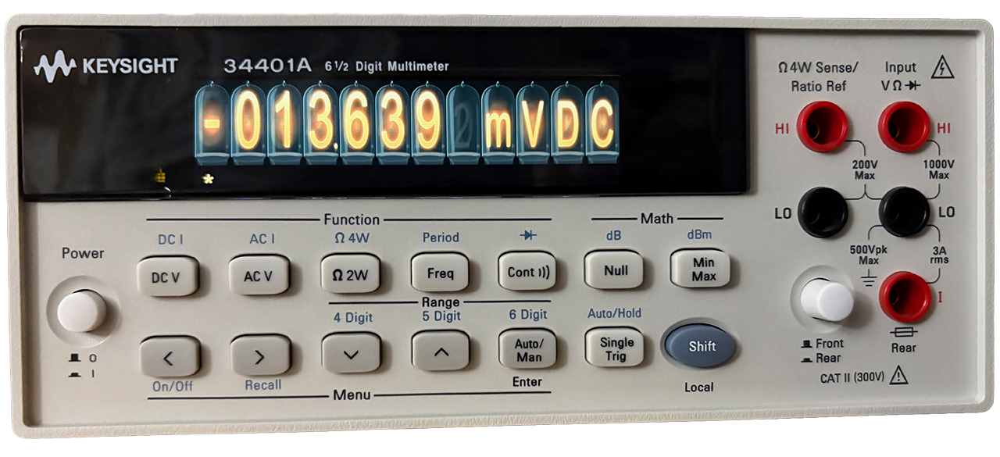
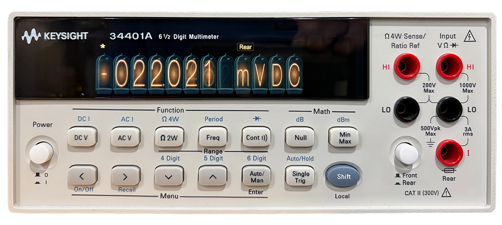
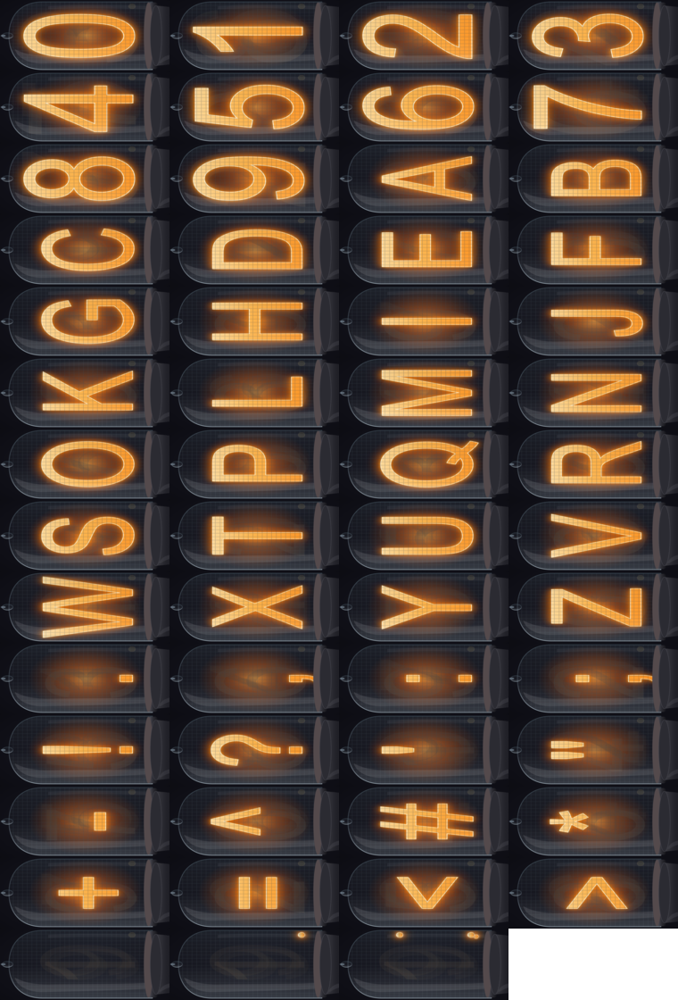
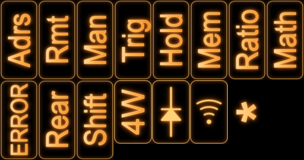
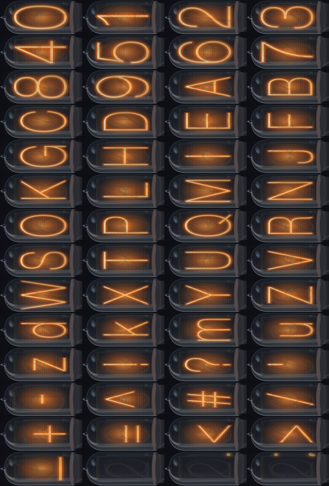

# LCDpico-34401A Themes

Currently included themes are following:


Theme|Sample Image|Notes
-----|------------|-----
nixie||Initial them with "bold" font.
nixiethin||More realistic Nixie tube renderings.


## Theme Graphics

### nixie




### nixiethin




## Selecting Theme

Theme can be select at compile time by setting ```LCDPICO_THEME``` setting.


For example:

```
$ cd build
$ cmake -DLCDPIO_THEME=nixiethin ..
$ make -j $(nproc)
```

